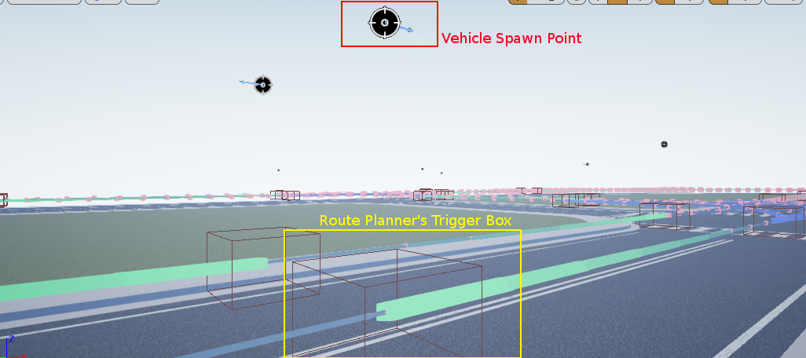
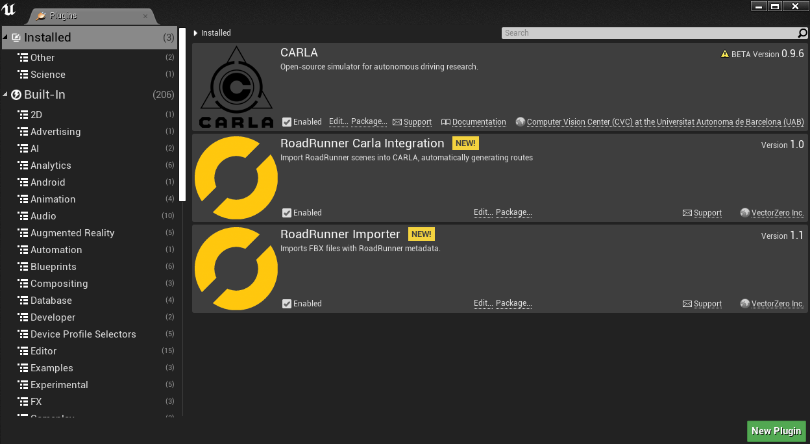
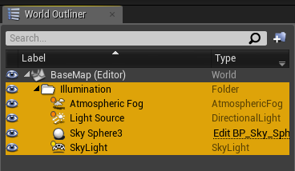
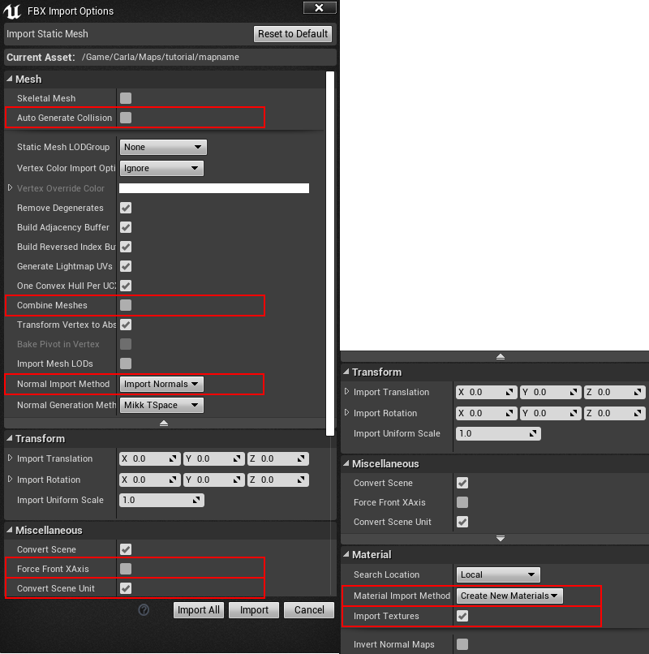
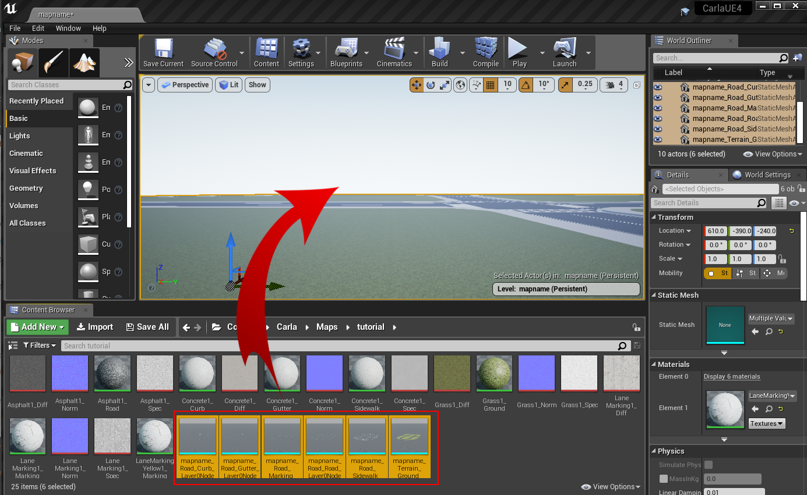
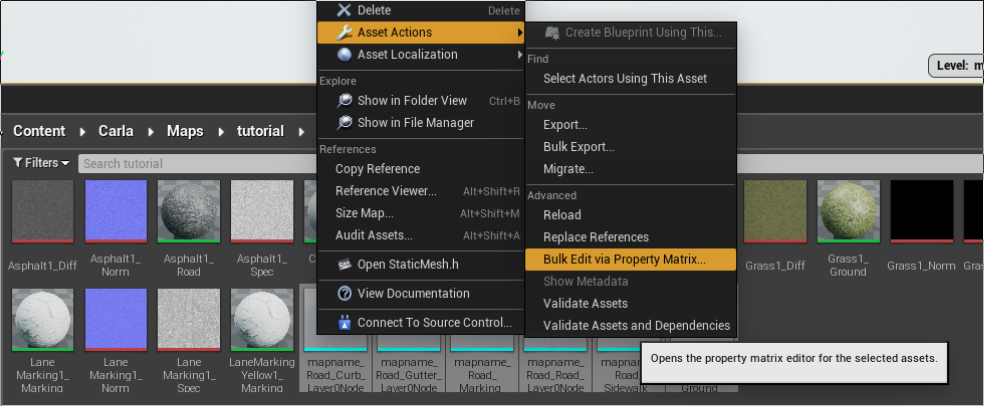
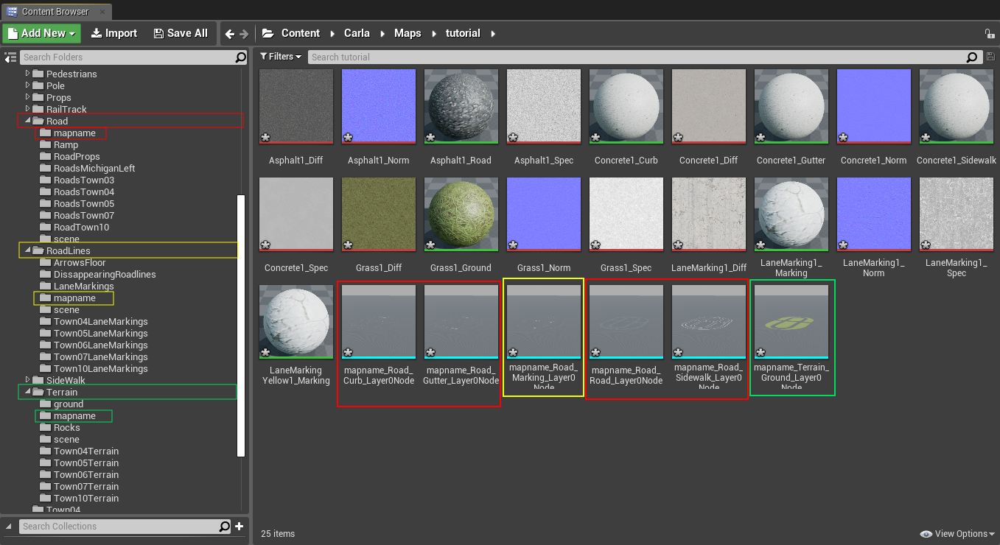
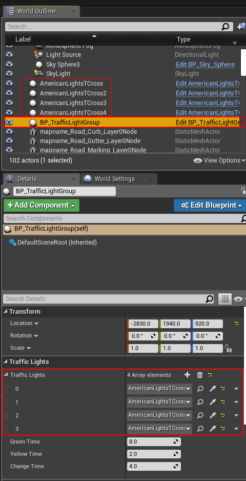
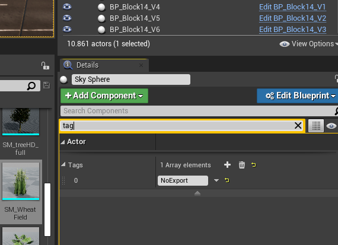
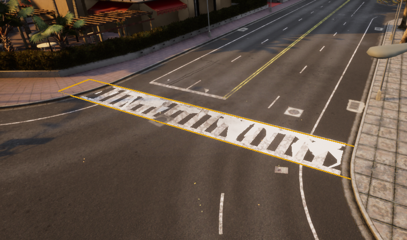

# Create and import a map

* [__Introduction__](#introduction)  
* [__Map creation with RoadRunner__](#map-creation-with-roadrunner)  
	* [Export the map](#export-the-map)  
* [__Import a map into CARLA__](#import-a-map-into-carla)  
* [__Final tips__](#final-tips)  
* [__Previous ways to import a map__](#previous-ways-to-import-a-map)  

---
## Introduction

In order to create a CARLA map, two elements are needed. This tutorial explains how to properly import them to CARLA. 

* __`.fbx` binaries.__ The meshes needed to build the map, such as roads, lanemarkings, sidewalks, ect.
* __`.xodr` OpenDRIVE file.__ Contains the road network information necessary for vehicles to navigate the map.

In order to create them, RoadRunner is the recommended software. It is quite easy to use, and it provides plugins that make the import process much simpler. Some basic steps are provided below. 

The process to import a map into CARLA is now out-of-the-box. A Docker image of Unreal Engine is used so that the user does not have neither to compile anything nor manually set the assets to fit into CARLA. 

!!! Note
    This tutorial creates a new map from scratch. Check these other tutorials to [customize a town](tuto_A_map_customization.md) or [import other assets](tuto_A_import_assets.md) to CARLA.

---
## Map creation with RoadRunner

RoadRunner is an accessible and powerful software from Vector Zero to create 3D scenes. There is a trial version available at their [site](https://www.vectorzero.io/), and an [installation guide][rr_docs].

[rr_docs]: https://tracetransit.atlassian.net/wiki/spaces/VS/pages/740622413/Getting+Started

The process is quite straightforward, but there are some things to take into account.  

* Center the map in (0,0).  
* Create the map definition. Take a look at the [official tutorials](https://www.youtube.com/channel/UCAIXf4TT8zFbzcFdozuFEDg/playlists).
* Check the map validation. Take a close look at all connections and geometries.


Once the map is ready, click on the `OpenDRIVE Preview Tool` button to visualize the OpenDRIVE road network. Give one last check to everything. Once the map is exported, it cannot be modified. 


!!! note
    _OpenDrive Preview Tool_ makes it easier to test the integrity of the map. If there is any error with junctions, click on `Maneuver Tool`, and `Rebuild Maneuver Roads`.
  
### Export the map

__1. Export the scene using the CARLA option.__ `File/Export/CARLA(.fbx+.xml+.xodr)`

__2. Leave `Export individual Tiles` unchecked.__ This will generate only one _.fbx_ with all the pieces. It makes easier to keep track of the map.  

__3. Click `Export`.__  

This will generate a `mapname.fbx` and `mapname.xodr` files within others. There is more detailed information about how to export to CARLA in [VectorZero's documentation][exportlink].

[exportlink]: https://tracetransit.atlassian.net/wiki/spaces/VS/pages/752779356/Exporting+to+CARLA

!!! Warning
    Make sure that the .xodr and the .fbx files have the same name.  

---
## Import a map into CARLA

This process will cook the map automatically from start to finish. Using only the .fbx and .xodr, the output will provide a fully usable CARLA map with traffic behaviour, and pedestrian navigation already implemented.  

__1. Build a Docker image of Unreal Engine.__ Follow [these instructions](https://github.com/carla-simulator/carla/tree/master/Util/Docker). The process takes quite a lot of time and disk space. Around 4h and 400GB to build the Docker image. However, this is only needed the first time. Then, the process of importing a new map is out-of-the-box. 

__2. Run the script to cook the map.__ In the folder `~/carla/Util/Docker` there is a script that connects with the Docker image previously created, and cooks the map automatically. It only needs the path for the input and output files.  
```sh
python docker_tools.py --input ~/path_to_input_assets --output ~/path_for_output_assets
```

__3. Move the output files__ to `Content/Carla/Maps` in case they are not already there. 

---
## Final tips

* __Add and test traffic light timing.__ This are not set automatically, and will need trial and error to fit perfectly with the city.


> _Example: Traffic Signs, Traffic lights and Turn based stop._


* __Place vehicle spawn points__ 2 to 3 meters above a Route Planner's trigger box, and oriented in the same direction. When the vehicle falls into the trigger box, the autopilot takes control of it.

  

* __Show individual route planners.__ `Generate Routes` in Open Drive Actor generates the road network but it does not show these. In order to do so, do the following.

    1. Select all `RoutePlanner` actors.
    2. Move them.
    3. Press `ctr + z`. They will show up on the map.
    

* __Modify OpenDRIVE routes.__ This can be done manually.

  

* __Add the map to the Unreal packaging system.__ Go to the following path and add the level. 
`Edit > Project Settings > Project > Packaging > Show Advanced > List of maps to include...` <br>

  

* __Use CARLA materials__ contained in `Content/Carla/Static/GenericMaterials`.
	* Go to the material. `Right-click on the Asset > Browse to Asset`.
	* Set the actors. `Right-click on Material > Asset Actions > Select Actors Using This Asset`


---
## Previous ways to import a map

There are other ways to import a map used in previous CARLA releases. These required to manually cook the map and prepare everything, so they became deprecated when the Docker method was developed. However, they are explained below in case they are needed. 

* __A) RoadRunner plugin import.__ This software provides specific plugins for CARLA. Get those and follow some simple steps to get the map.  
* __B) Manual import.__ This process requires to go through all the process manually. From importing _.fbx_ and _.xodr_ to setting the static meshes.  

  <details>
    <summary><h4 style="display:inline">
    Deprecated tutorials to import a map
    </h4></summary>

!!! Warning
    These importing tutorials are deprecated. The best way to import a map into CARLA is to use the Docker as explained above. 

## A- RoadRunner plugin import

### Plugin installation

These plugins will set everything ready to be used in CARLA. It makes the import process more simple. 

__1. Locate the plugins__ in RoadRunner's installation folder  
`/usr/bin/VectorZero/Tools/Unreal/Plugins`.

__2. Copy those folders__ to the CarlaUE4 plugins directory `/carla/Unreal/CarlaUE4/Plugins/`.

__3. Rebuild the plugin__ following the instructions below.  

* __a) Rebuild on Windows.__  
	* Right-click the `.uproject` file and `Generate Visual Studio project files`.  
	* Open the project and build the plugins.  

* __b) Rebuild on Linux.__  
	* Run the following command.  
```sh
> UE4_ROOT/GenerateProjectFiles.sh -project="carla/Unreal/CarlaUE4/CarlaUE4.uproject" -game -engine
```

__4. Restart Unreal Engine.__ Make sure the checkbox is on for both plugins `Edit > Plugins`. 



### Import map

__1. Import the _mapname.fbx_ file__ to a new folder under `/Content/Carla/Maps` with the `Import` button.  


__2. Set `Scene > Hierarchy Type`__ to _Create One Blueprint Asset_ (selected by default).  
__3. Set `Static Meshes > Normal Import Method`__ to _Import Normals_.  


__4. Click `Import`.__  
__5. Save the current level__ `File > Save Current As...` > _mapname_.  

The new map should now appear next to the others in the Unreal Engine _Content Browser_.


---
## B- Manual import from files

This is the generic way to import maps into Unreal Engine using any _.fbx_ and _.xodr_ files. As there is no plugin to ease the process, there are many settings to be done before the map is available in CARLA.  

__1. Create a new level__ with the **Map** name in Unreal `Add New > Level` under `Content/Carla/Maps`.  
__2. Copy the illumination folder and its content__ from the BaseMap `Content/Carla/Maps/BaseMap`, and paste it in the new level. Otherwise, the map will be in the dark.



### Import binaries

__1. Import the _mapname.fbx_ file__ to a new folder under `/Content/Carla/Maps` with the `Import` button. __Make sure the following options are unchecked.__

* Auto Generate Collision  
* Combine Meshes  
* Force Front xAxis  
* Normal Import Method - _To import normals_  

__2. Check the following options.__  

* Convert Scene Unit
* _To import materials and textures._
    * Material Import Method - _To create new materials_
    * Import Textures



__3. Check that the static meshes have appeared__ in the chosen folder.

__4. Drag the meshes__ into the level.



__5. Center the meshes at point (0,0,0)__ when Unreal finishes loading. 


__6. Generate collisions__. Otherwise, pedestrians and vehicles will fall into the abyss.

* Select the meshes meant to have colliders.
* Right-click `Asset Actions > Bulk Edit via Property Matrix...`.

  

* Search for _collision_ in Property's Matrix search box.
* Change `Collision complexity` from `Project Default` to `Use Complex Collision As Simple`.

  

* Go to `File > Save All`.

__7. Move the static meshes__ from `Content/Carla/Maps/mapfolder` to the corresponding `Carla/Static` subsequent folder. This will be meaningful for the semantic segmentation ground truth.  

  * `Terrain/mapname`
  * `Road/mapname`
  * `RoadLines/mapname`

```sh
Content
└── Carla
    ├── Blueprints
    ├── Config
    ├── Exported Maps
    ├── HDMaps
    ├── Maps
    └── Static
        ├── Terrain
        │   └── mapname
        │       └── Static Meshes
        │
        ├── Road
        │   └── mapname
        │       └── Static Meshes
        │
        ├── RoadLines  
        |   └── mapname
        |       └── Static Meshes
        └── Sidewalks  
            └── mapname
                └── Static Meshes
```



### Import OpenDRIVE files

__1. Copy the `.xodr` file__ inside the `Content/Carla/Maps/OpenDrive` folder.  
__2. Open the Unreal level.__ Drag the _Open Drive Actor_ inside the level. It will read the level's name. Search the Opendrive file with the same name and load it.


---
## Set traffic behavior

Once everything is loaded into the level, it is time to create traffic behavior.  

__1. Click on the _Open Drive Actor_.__  
__2. Check the following boxes in the same order.__  

* Add Spawners.  
* _(Optional for more spawn points)_ On Intersections.  
* Generate Routes.  

This will generate a series of _RoutePlanner_ and _VehicleSpawnPoint_ actors. These are used for vehicle spawning and navigation.

### Traffic lights and signs

Traffic lights and signs must be placed all over the map.

__1. Drag traffic light/sign actors__ into the level and place them.  
__2. Adjust the [`trigger volume`][triggerlink]__ for each of them. This will determine their area of influence.  
  [triggerlink]: python_api.md#carla.TrafficSign.trigger_volume


__3. In junctions, drag a traffic light group actor__ into the level. Assign to it all the traffic lights involved and configure their timing. Make sure to understand [how do traffic lights work](http://127.0.0.1:8000/core_actors/#traffic-signs-and-traffic-lights).  



__4. Test traffic light timing and traffic trigger volumes.__ This may need trial and error to fit perfectly.


> _Example: Traffic Signs, Traffic lights and Turn based stop._

---
## Add pedestrian navigation

In order to prepare the map for pedestrian navigation, there are some settings to be done before exporting it.  

__1.__ Select the __Skybox object__ and add a tag `NoExport` to it. Otherwise, the map will not be exported, as the size would be too big. 

 

__2.__ Check the name of the meshes. By default, pedestrians will be able to walk over sidewalks, crosswalks, and grass (with minor influence over the rest).

 

__3.__ Crosswalks have to be manually created. For each of them, create a plane mesh that extends a bit over both sidewalks connected. __Place it overlapping the ground, and disable its physics and rendering__. 

 

__4.__ Name these planes following the common format `Road_Crosswalk_mapname`. 

__5.__ Press `G` to deselect everything, and export the map. `File > Export CARLA...`.  
__6.__ Run RecastDemo `./RecastDemo`.  

  * Select `Solo Mesh` from the `Sample` parameter's box.
  * Select the _mapname.obj_ file from the `Input Mesh` parameter's box.


__7.__ Click on the `Build` button.  
__8.__ Once the build has finished, click on the `Save` button.  
__9.__ Change the **filename** of the binary file generated at `RecastDemo/Bin` to `mapname.bin`.  
__10.__ Drag the _mapname.bin_ file into the `Nav` folder under `Content/Carla/Maps`.  

</details>
<br>
